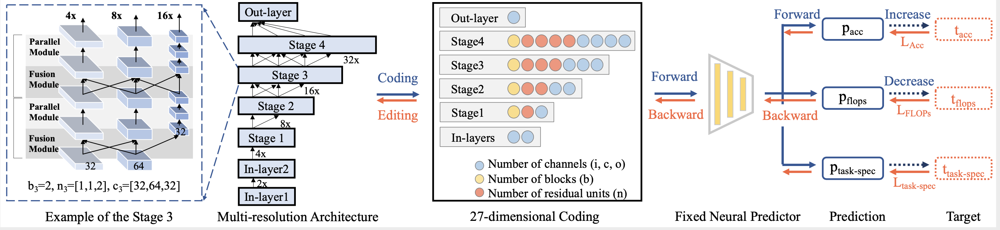
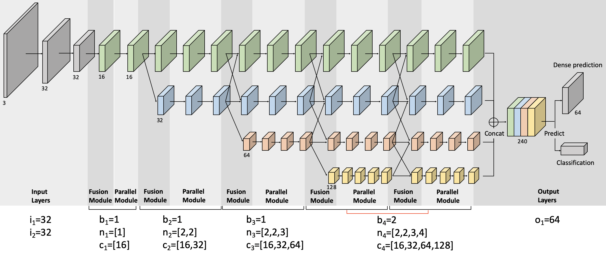

# Learning Versatile Neural Architectures by Propagating Network Codes (ICLR 2022)

Mingyu Ding, Yuqi Huo, Haoyu Lu, Linjie Yang, Zhe Wang, Zhiwu Lu, Jingdong Wang, Ping Luo




Demos and details can be found at the [Project Page](https://network-propagation.github.io/).

If you find our work useful in your research, please consider citing our paper:

    @inproceedings{ding2022learning,
      author = {Ding, Mingyu and Huo, Yuqi and Lu, Haoyu and Yang, Linjie and Wang, Zhe and Lu, Zhiwu and Wang, Jingdong and Luo, Ping},
      title = {Learning Versatile Neural Architectures by Propagating Network Codes},
      booktitle = {International Conference on Learning Representations},
      year = {2022}
    }

## Introduction
This work includes:  
(1) **NAS-Bench-MR**, a NAS benchmark built on four challenging datasets under practical training settings for learning task-transferable architectures.  
(2) An efficient predictor-based algorithm **Network Coding Propagation (NCP)**, which back-propagates the gradients of neural predictors to directly update architecture codes along desired gradient directions for various objectives.

This framework is implemented and tested with Ubuntu/Mac OS, CUDA 9.0/10.0, Python 3, Pytorch 1.3-1.6, NVIDIA Tesla V100/CPU.

## Dataset
We build our benchmark on four computer vision tasks, i.e., image classification (ImageNet), semantic segmentation (CityScapes), 3D detection (KITTI), and video recognition (HMDB51).
Totally 9 different settings are included, as shown in the `data/*/trainval.pkl` folders.

Note that each `.pkl` file contains more than 2500 architectures, and their corresponding evaluation results under multiple metrics.
The original training logs and checkpoints (including model weights and optimizer data) can be found in [OneDrive](https://connecthkuhk-my.sharepoint.com/:f:/g/personal/u3007305_connect_hku_hk/ErvNgHDxVJ5FsXpvBFm7LQwBY3fCsLCMexJU3NeXOS7kZA?e=GTG3UL).

## Quick start
### First, train the predictor
```shell
python3 tools/train_predictor.py  # --cfg configs/seg.yaml
```

### Then, edit architecture based on desired gradients 
```shell
python3 tools/ncp.py  # --cfg configs/seg.yaml
```


## Examples

- An example in NAS-Bench-MR (Seg):
```python
{'mIoU': 70.57,
 'mAcc': 80.07,
 'aAcc': 95.29,
 'input_channel': [16, 64],
 # [num_branches, [num_convs], [num_channels]]
 'network_setting': [[1, [3], [128]],
  [2, [3, 3], [32, 48]],
  [2, [3, 3], [32, 48]],
  [2, [3, 3], [32, 48]],
  [3, [2, 3, 2], [16, 32, 16]],
  [3, [2, 3, 2], [16, 32, 16]],
  [4, [2, 4, 1, 1], [96, 112, 48, 80]]],
 'last_channel': 112,
 # [num_branches, num_block1, num_convs1, num_channels1, ..., num_block4, num_convs4, num_channels4, last_channel]
 'embedding': [16, 64, 1, 3, 128, 3, 3, 3, 32, 48, 2, 2, 3, 2, 16, 32, 16, 1, 2, 4, 1, 1, 96, 112, 48, 80]
}
```

- Load Datasets:
```python3
import pickle
exps = pickle.load(open('data/seg/trainval.pkl', 'rb'))
# Then process each item in exps
```

- Load Model / Get Params and Flops (based on the thop library):
```python3
import torch
from thop import profile
from models.supernet import MultiResolutionNet

# Get model using input_channel & network_setting & last_channel
model = MultiResolutionNet(input_channel=[16, 64],
                           network_setting=[[1, [3], [128]],
                            [2, [3, 3], [32, 48]],
                            [2, [3, 3], [32, 48]],
                            [2, [3, 3], [32, 48]],
                            [3, [2, 3, 2], [16, 32, 16]],
                            [3, [2, 3, 2], [16, 32, 16]],
                            [4, [2, 4, 1, 1], [96, 112, 48, 80]]],
                          last_channel=112)

# Get Flops and Parameters
input = torch.randn(1, 3, 224, 224)
macs, params = profile(model, inputs=(input, ))  
```



## Data Format
Each code in `data/search_list.txt` denotes an architecture. It can be load in our supernet as follows:

- Code2Setting
```python3
params = '96_128-1_1_1_48-1_2_1_1_128_8-1_3_1_1_1_128_128_120-4_4_4_4_4_4_128_128_128_128-64'
embedding = [int(item) for item in params.replace('-', '_').split('_')]

embedding = [ 96, 128,   1,   1,  48,   1,   1,   1, 128,   8,   1,   1,
           1,   1, 128, 128, 120,   4,   4,   4,   4,   4, 128, 128,
         128, 128, 64]
input_channels = embedding[0:2]
block_1 = embedding[2:3] + [1] + embedding[3:5]
block_2 = embedding[5:6] + [2] + embedding[6:10]
block_3 = embedding[10:11] + [3] + embedding[11:17]
block_4 = embedding[17:18] + [4] + embedding[18:26]
last_channels = embedding[26:27]
network_setting = []
for item in [block_1, block_2, block_3, block_4]:
    for _ in range(item[0]):
        network_setting.append([item[1], item[2:-int(len(item) / 2 - 1)], item[-int(len(item) / 2 - 1):]])

# network_setting = [[1, [1], [48]], 
#  [2, [1, 1], [128, 8]],
#  [3, [1, 1, 1], [128, 128, 120]], 
#  [4, [4, 4, 4, 4], [128, 128, 128, 128]], 
#  [4, [4, 4, 4, 4], [128, 128, 128, 128]], 
#  [4, [4, 4, 4, 4], [128, 128, 128, 128]], 
#  [4, [4, 4, 4, 4], [128, 128, 128, 128]]]
# input_channels = [96, 128]
# last_channels = [64]
```

- Setting2Code
```python3
input_channels = [str(item) for item in input_channels]
block_1 = [str(item) for item in block_1]
block_2 = [str(item) for item in block_2]
block_3 = [str(item) for item in block_3]
block_4 = [str(item) for item in block_4]
last_channels = [str(item) for item in last_channels]

params = [input_channels, block_1, block_2, block_3, block_4, last_channels]
params = ['_'.join(item) for item in params]
params = '-'.join(params)
# params
# 96_128-1_1_1_48-1_2_1_1_128_8-1_3_1_1_1_128_128_120-4_4_4_4_4_4_128_128_128_128-64'
```


## License
For academic use, this project is licensed under the 2-clause BSD License. 
For commercial use, please contact the author.
